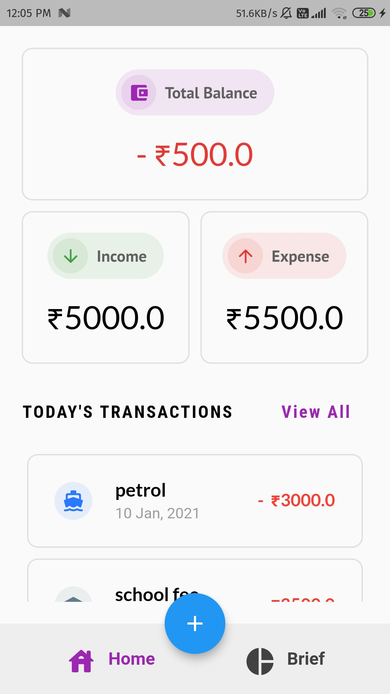
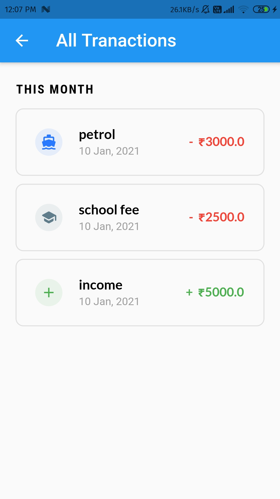
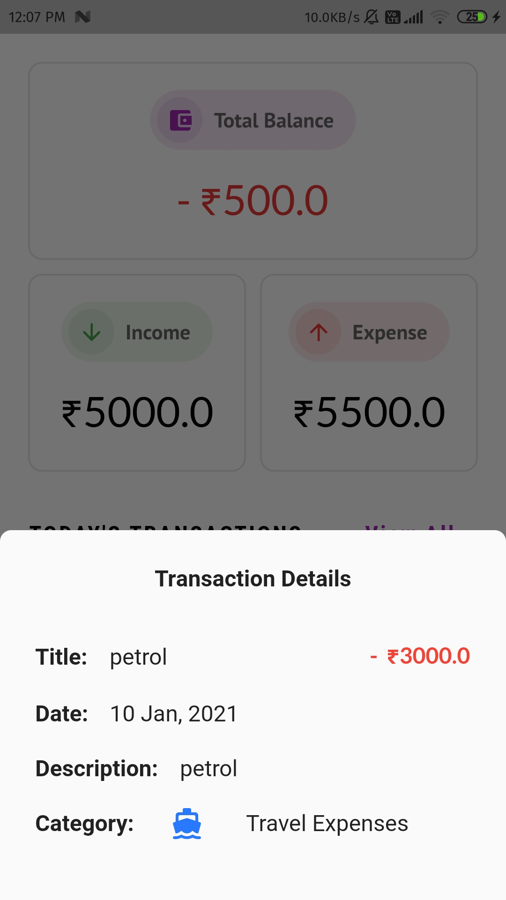
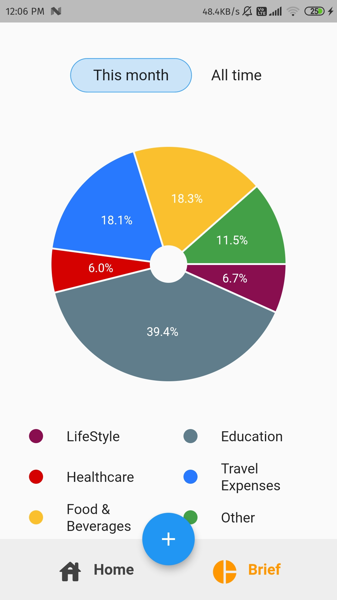
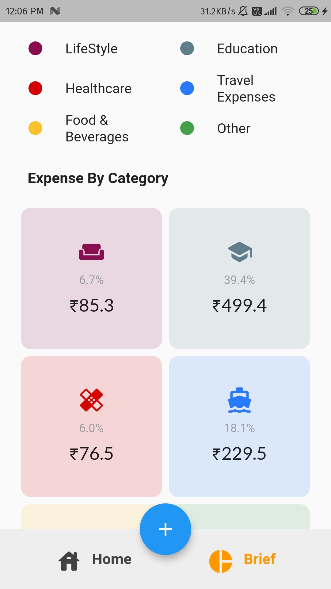
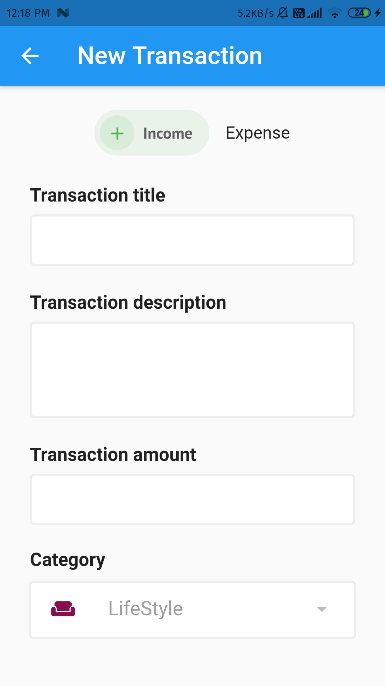
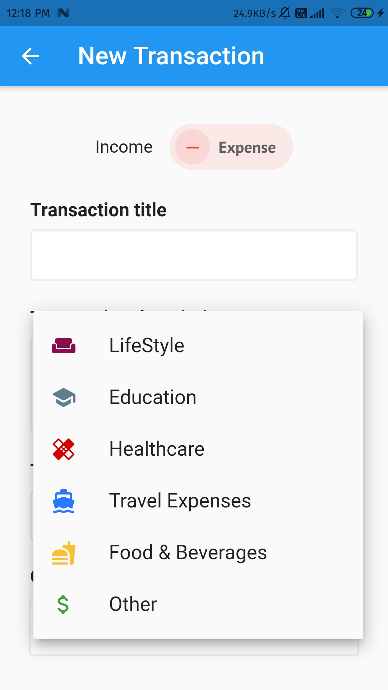

# Expense Tracker App

An app in Flutter for tracking expenses.

#### Screenshots

##### Main Screen

---

##### All transactions Screen

---

##### Transaction details

---

##### Expenses Overview Screen

> **Note:** The overview page was generated using random data for demonstration purpose

---

##### Add Transaction Screen

